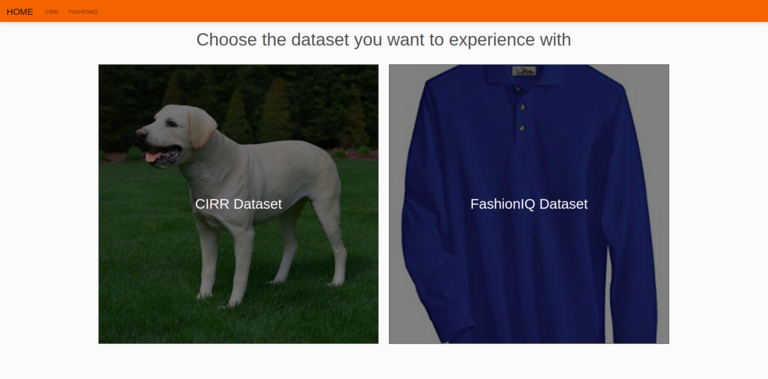
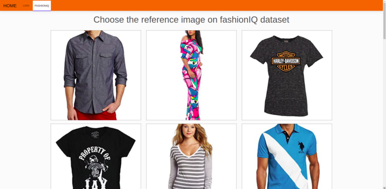
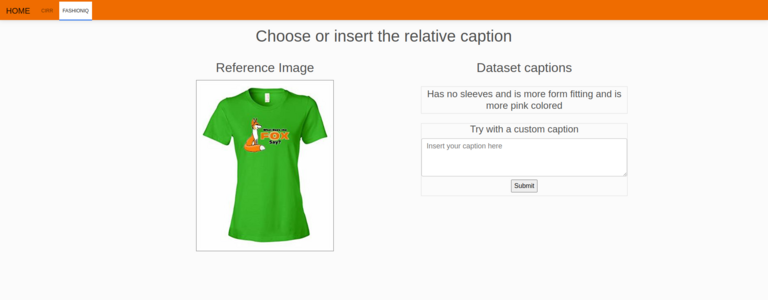
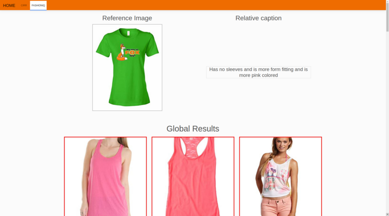

# CLIP4CirDemo
### CLIP for Conditioned image retrieval Demo

### Built With
* [Python](https://www.python.org/)
* [PyTorch](https://pytorch.org/)
* [Torchvision](https://pytorch.org/vision/stable/index.html)
* [CLIP](https://github.com/openai/CLIP)
* [Flask](https://flask.palletsprojects.com/en/2.0.x/)
* [Bootstrap](https://getbootstrap.com/)


## Getting Started

To get a local copy up and running follow these simple steps.

### Prerequisites

We strongly recommend the use of the [**Anaconda**](https://www.anaconda.com/) package manager in order to avoid dependency/reproducibility problems.
A conda installation guide for linux systems can be found [here](https://docs.conda.io/projects/conda/en/latest/user-guide/install/linux.html)

### Installation
 
1. Clone the repo
```sh
git clone https://github.com/ABaldrati/CLIP4CirDemo
```
2. Install Python dependencies
```sh
conda create -n clip4cir -y python=3.8
conda activate clip4cir
conda install -y -c pytorch pytorch=1.7.1 torchvision=0.8.2
pip install flask==2.0.2
pip install Werkzeug==2.2.2
pip install git+https://github.com/openai/CLIP.git
```
3. Download [**FashionIQ images**](https://www.kaggle.com/datasets/bitamesbah/fashioniq-bit?select=images) \(only download \'images\' folder\) and [**FashionIQ captions**](https://drive.google.com/drive/folders/1UMlrNQxCKLqXGMik4gpSx_Gdn65m_xal?usp=drive_link) \(captions) and [**FashionIQ images_split**](https://drive.google.com/drive/folders/1YAi261I1c5MqJ_9umxj4Be4Dw-FbhoOG?usp=drive_link) \(images_split)
## Usage
Here's a brief description of each and every file and folder in the repo:

* ```utils.py```: Utils file
* ```model.py```: Combiner model definition file
* ```data_utils.py```: Dataset loading and preprocessing utils file
* ```extract_features.py```: Feature extraction file
* ```hubconf.py```: Torch Hub config file
* ```app.py```: Flask server file
* ```static```: Flask static files folder
* ```templates```: Flask templates folder

### Data Preparation
To properly work with the codebase [**FashionIQ**](https://sites.google.com/view/cvcreative2020/fashion-iq)
datasets should have the following structure:


```
project_base_path
└───  fashionIQ_dataset
      └─── captions
            | cap.dress.test.json
            | cap.dress.train.json
            | cap.dress.val.json
            | ...
            
      └───  images
            | B00006M009.jpg
            | B00006M00B.jpg
            | B00006M6IH.jpg
            | ...
            
      └─── image_splits
            | split.dress.test.json
            | split.dress.train.json
            | split.dress.val.json
            | ...
```

### Feature Extraction
Before launching the demo it is necessary to extract the features 
using the following command or download extracted features from (https://drive.google.com/drive/folders/1Ruh02GEK_zk_BwhVxl-YUxn7FI7C6lv0?usp=drive_link)
```shell
python extract_features.py
```
File structure:
```
project_base_path
└───  fashionIQ_dataset
└───  data
        └───  *.pt
        └───  *.pkl
└───  *.py
```

### Run the Demo
Start the server and run the demo using the following command
```shell
python app.py
```
By default, the server run on port 5000 of localhost address: http://127.0.0.1:5000/


## Demo overview
* Initially choose the dataset you want to experience with. As the image 
shown by the image you can experience with CIRR dataset or FashionIQ dataset



* Choose the reference image 



* Choose or manually insert the relative caption



* Check out the results. By clicking on a
retrieved image you can use such image as reference image in a
new query




## Authors
* [**Alberto Baldrati**](https://scholar.google.it/citations?hl=en&user=I1jaZecAAAAJ)
* [**Marco Bertini**](https://scholar.google.it/citations?user=SBm9ZpYAAAAJ&hl=en)
* [**Tiberio Uricchio**](https://scholar.google.it/citations?user=XHZLRdYAAAAJ&hl=en)
* [**Alberto Del Bimbo**](https://scholar.google.it/citations?user=bf2ZrFcAAAAJ&hl=en)


